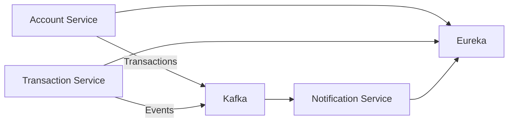

# Banking Microservices 🚀

*(Spring Boot + JPA + Kafka + Eureka + Docker Compose)*

ระบบไมโครเซอร์วิสตัวอย่างสำหรับงานธนาคาร รองรับ:

* จัดการบัญชี (Account Management)
* การโอนเงิน (Money Transfer)
* การบันทึกทรานแซกชัน (Transaction Logging)
* การแจ้งเตือนแบบ Event-driven (Event-driven Notifications)
* Service Discovery ผ่าน **Eureka**
* Messaging ผ่าน **Kafka Topics**: `transactions`, `notifications`


## 🏗️ Architecture



---

## ⚡ Services & Ports

| Service              | Port       |
| -------------------- | ---------- |
| Zookeeper            | 2181       |
| Kafka                | 9092, 9094 |
| Eureka Server        | 8761       |
| Account Service      | 8080       |
| Transaction Service  | 8081       |
| Notification Service | 8082       |

---

## 🔧 Prerequisites

* **Docker & Docker Compose**
* **Maven**
* **JDK 17+**
* (Frontend) **Node.js v14+ และ npm**

---

## 🚀 Quick Start

### Backend

```bash
cd banking-system
cp .env.example .env   # (ถ้ามี)
docker-compose up --build -d
docker-compose ps
```

* Eureka Dashboard → [http://localhost:8761](http://localhost:8761)
* Account Service → [http://localhost:8080](http://localhost:8080)
* Transaction Service → [http://localhost:8081](http://localhost:8081)
* Notification Service → [http://localhost:8082](http://localhost:8082)

### Frontend

```bash
cd banking-frontend
npm install
npm start
```

* Frontend → [http://localhost:3000](http://localhost:3000)

---

## 🧪 Testing

### ผ่าน Frontend UI

* สร้างบัญชี → กรอกชื่อ, email, balance
* โอนเงิน → เลือกบัญชีต้นทาง, ปลายทาง, จำนวนเงิน
* ดูประวัติ → ตรวจสอบทรานแซกชัน

### ผ่าน API (curl/Postman)

**Account Service** (`:8080`)

```http
POST /accounts
{
  "ownerName": "John Doe",
  "email": "john@example.com",
  "initialBalance": 1000
}
```

**Transaction Service** (`:8081`)

```http
POST /transactions/transfer
{
  "fromAccount": 1,
  "toAccount": 2,
  "amount": 100
}
```

**Notification Service** (`:8082`)

```http
GET /health
```

Swagger UI:

* [http://localhost:8080/swagger-ui.html](http://localhost:8080/swagger-ui.html)
* [http://localhost:8081/swagger-ui.html](http://localhost:8081/swagger-ui.html)

---

## 📦 Local Development

```bash
mvn clean package          # Build JARs
docker-compose up -d       # Run all services
docker-compose logs -f     # Tail logs
docker-compose down        # Stop
```

---

## 🛠️ Implementation Notes

* Spring Boot + JPA + Bean Validation
* CRUD + PATCH (JSON Merge Patch)
* @Transactional → ตรวจสอบ balance → update → save → publish Kafka event
* Error Response → `application/problem+json`
* Swagger/OpenAPI enabled
* Profile: dev (H2), prod (Postgres)

---

## 🗺️ Roadmap

* [ ] PostgreSQL + ACID Transactions
* [ ] OAuth2 / OIDC Authentication
* [ ] Observability (Prometheus + Grafana, tracing)
* [ ] Load testing & scaling policies

---

## 📜 License

MIT License

---
