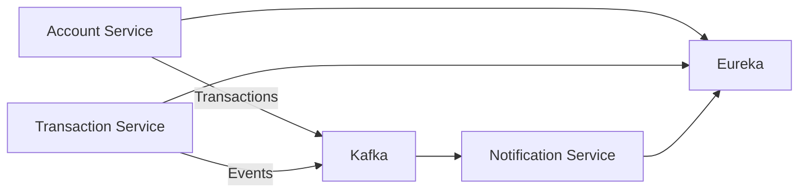

# Banking Microservices (Spring Boot + JPA + Kafka + Eureka + Docker Compose)

ระบบไมโครเซอร์วิสต์ตัวอย่างสำหรับงานธนาคาร รองรับบัญชีผู้ใช้ การโอนเงิน บันทึกทรานแซกชัน และการแจ้งเตือนแบบอิงเหตุการณ์ พร้อมสัญญา API ครบ CRUD (GET/POST/PUT/PATCH/DELETE)

หมายเหตุ: โปรเจกต์ต้นทางใช้ Spring Boot + Apache Kafka + Netflix Eureka + Docker Compose และมีตัวอย่าง Endpoint/พอร์ต/Environment/Kafka topics ตามที่อธิบายไว้เดิม [README.md]

---

## Overview
- ความสามารถหลัก:
  - Account management
  - Money transfers
  - Transaction logging
  - Event-driven notifications
  - Service discovery ด้วย Eureka
  - สื่อสารผ่าน Kafka topics: transactions, notifications [README.md]

## How to Run the Backend Services

### Prerequisites
- Docker & Docker Compose
- Maven
- JDK 17 (หรือเวอร์ชันที่รองรับ Spring Boot) [README.md]

### Running All Services
To start all backend services (Zookeeper, Kafka, Eureka Server, Account Service, Transaction Service, Notification Service):

```bash
# Navigate to the banking-system directory
cd banking-system

# Copy environment variables (if .env.example exists)
# cp .env.example .env

# Build & start all services
docker-compose up --build -d

# Check container status
docker-compose ps
```

### Accessing Services
After starting the services, you can access them at:
- Eureka Dashboard: http://localhost:8761
- Account Service: http://localhost:8080
- Transaction Service: http://localhost:8081
- Notification Service: http://localhost:8082

### Stopping Services
To stop all services:
```bash
# Navigate to the banking-system directory
cd banking-system

# Stop all services
docker-compose down
```

## How to Run the Frontend

### Prerequisites
- Node.js (version 14 or higher)
- npm (comes with Node.js)

### Running the Frontend
To start the frontend application:

```bash
# Navigate to the banking-frontend directory
cd banking-frontend

# Install dependencies (if not already installed)
npm install

# Start the development server
npm start
```

The frontend will be available at: http://localhost:3000

### Building for Production
To build the frontend for production:

```bash
# Navigate to the banking-frontend directory
cd banking-frontend

# Build the application
npm run build
```

The production build will be in the `build` folder.

## Complete Startup Instructions

To run the complete banking system, follow these steps in order:

1. **Start the Backend Services**
   ```bash
   # Navigate to the banking-system directory
   cd banking-system
   
   # Start all backend services
   docker-compose up --build -d
   
   # Wait for all services to start (this may take a minute)
   # You can check the status with:
   docker-compose ps
   ```

2. **Verify Backend Services**
   - Open your browser and go to the Eureka Dashboard: http://localhost:8761
   - Confirm that all services (ACCOUNT-SERVICE, TRANSACTION-SERVICE, NOTIFICATION-SERVICE) are registered and showing "UP" status

3. **Start the Frontend**
   ```bash
   # In a new terminal, navigate to the banking-frontend directory
   cd banking-frontend
   
   # Install dependencies (if not already installed)
   npm install
   
   # Start the frontend application
   npm start
   ```

4. **Access the Application**
   - The frontend will be available at: http://localhost:3000
   - You can now use the banking application to create accounts, transfer money, and view transactions

### Shutdown Instructions

To properly shut down the system:

1. **Stop the Frontend**
   - In the terminal where you ran `npm start`, press `Ctrl + C` to stop the frontend server

2. **Stop the Backend Services**
   ```bash
   # Navigate to the banking-system directory
   cd banking-system
   
   # Stop all backend services
   docker-compose down
   ```

## How to Test the System

### Testing with the Frontend UI

1. **Create Accounts**
   - Navigate to the "Accounts" section
   - Click "Create Account"
   - Fill in the account details (name, email, initial balance)
   - Submit the form

2. **View Accounts**
   - In the "Accounts" section, you should see your created accounts
   - Click on an account to view its details and balance

3. **Transfer Money**
   - Navigate to the "Transactions" section
   - Click "Transfer Money"
   - Enter the from account, to account, and amount
   - Submit the transfer

4. **View Transactions**
   - In the "Transactions" section, you can see all transactions
   - You can also view specific transaction details

### Testing with API Calls (Using curl or Postman)

You can test all HTTP methods (GET, POST, PUT, DELETE, PATCH) using both Postman and the frontend application.

#### 1. Account Service (http://localhost:8080)

**POST /accounts** - Create a new account
```
POST http://localhost:8080/accounts
Content-Type: application/json

{
  "ownerName": "John Doe",
  "email": "john.doe@example.com",
  "initialBalance": 1000.00
}
```

**GET /accounts** - Get all accounts
```
GET http://localhost:8080/accounts
```

**GET /accounts/{id}** - Get account by ID
```
GET http://localhost:8080/accounts/1
```

**PUT /accounts/{id}** - Update entire account
```
PUT http://localhost:8080/accounts/1
Content-Type: application/json

{
  "ownerName": "John Smith",
  "email": "john.smith@example.com",
  "balance": 1500.00,
  "status": "ACTIVE"
}
```

**PATCH /accounts/{id}** - Partially update account
```
PATCH http://localhost:8080/accounts/1
Content-Type: application/json

{
  "ownerName": "John Updated",
  "balance": 2000.00
}
```

**DELETE /accounts/{id}** - Delete account
```
DELETE http://localhost:8080/accounts/1
```

#### 2. Transaction Service (http://localhost:8081)

**POST /transactions/transfer** - Transfer money
```
POST http://localhost:8081/transactions/transfer
Content-Type: application/json

{
  "fromAccount": 1,
  "toAccount": 2,
  "amount": 100.00
}
```

**POST /transactions** - Create a transaction manually
```
POST http://localhost:8081/transactions
Content-Type: application/json

{
  "fromAccountId": 1,
  "toAccountId": 2,
  "amount": 50.00,
  "reason": "Manual transaction"
}
```

**GET /transactions** - Get all transactions
```
GET http://localhost:8081/transactions
```

**GET /transactions/{id}** - Get transaction by ID
```
GET http://localhost:8081/transactions/1
```

**PUT /transactions/{id}** - Update entire transaction
```
PUT http://localhost:8081/transactions/1
Content-Type: application/json

{
  "fromAccountId": 1,
  "toAccountId": 3,
  "amount": 75.00,
  "status": "CANCELED",
  "reason": "Cancel transfer"
}
```

**PATCH /transactions/{id}** - Partially update transaction
```
PATCH http://localhost:8081/transactions/1
Content-Type: application/json

{
  "reason": "Updated reason",
  "status": "CANCELED"
}
```

**DELETE /transactions/{id}** - Delete transaction
```
DELETE http://localhost:8081/transactions/1
```

### Testing with Frontend Application

Yes, you can also test all these operations through the frontend application:

#### 1. Account Operations
- **POST**: Use the "Create Account" form in the Accounts section
- **GET**: View accounts in the Accounts list and click to see details
- **PUT**: Use the "Edit Account" form (if available in UI)
- **PATCH**: Use partial update forms (if available in UI)
- **DELETE**: Use the "Delete Account" button (if available in UI)

#### 2. Transaction Operations
- **POST**: Use the "Transfer Money" form in the Transactions section
- **GET**: View transactions in the Transactions list and click to see details
- **PUT**: Use the "Edit Transaction" form (if available in UI)
- **PATCH**: Use partial update forms (if available in UI)
- **DELETE**: Use the "Delete Transaction" button (if available in UI)

### API Documentation

You can also access the Swagger UI for each service to test directly:
- Account Service: http://localhost:8080/swagger-ui.html
- Transaction Service: http://localhost:8081/swagger-ui.html

These Swagger UIs provide interactive documentation where you can:
1. See all available endpoints
2. View request/response schemas
3. Test each endpoint directly in the browser
4. See example requests and responses

Both Postman and the frontend application are valid ways to test the system. Postman gives you more direct control over the HTTP requests, while the frontend provides a user-friendly interface that demonstrates how a real user would interact with the system.

### Testing Service Health

1. **Check Eureka Dashboard**
   - Visit http://localhost:8761
   - All services should show "UP" status

2. **Check Notification Service Health**
   ```bash
   curl http://localhost:8082/health
   ```

### Common Testing Scenarios

1. **Successful Transfer**
   - Create two accounts with sufficient balance
   - Transfer money from one to another
   - Verify balances are updated correctly

2. **Insufficient Balance Transfer**
   - Try to transfer more money than available in an account
   - Verify the transaction is rejected

3. **Invalid Account Transfer**
   - Try to transfer to a non-existent account
   - Verify the transaction is rejected

4. **View Account Statements**
   - After several transactions, view an account's statements
   - Verify all transactions are listed

## How to Run the Backend Services

### Prerequisites
- Docker & Docker Compose
- Maven
- JDK 17 (หรือเวอร์ชันที่รองรับ Spring Boot) [README.md]

### Running All Services
To start all backend services (Zookeeper, Kafka, Eureka Server, Account Service, Transaction Service, Notification Service):

```bash
# Navigate to the banking-system directory
cd banking-system

# Copy environment variables (if .env.example exists)
# cp .env.example .env

# Build & start all services
docker-compose up --build -d

# Check container status
docker-compose ps
```

### Accessing Services
After starting the services, you can access them at:
- Eureka Dashboard: http://localhost:8761
- Account Service: http://localhost:8080
- Transaction Service: http://localhost:8081
- Notification Service: http://localhost:8082

### Stopping Services
To stop all services:
```bash
# Navigate to the banking-system directory
cd banking-system

# Stop all services
docker-compose down
```

---

## Architecture

อ้างอิงภาพรวมสถาปัตยกรรมจาก README เดิม [README.md]

---

## Services & Ports
- Zookeeper: 2181
- Kafka: 9092, 9094
- Eureka Naming Server: 8761
- Account Service: 8080
- Transaction Service: 8081
- Notification Service: 8082
อ้างอิงค่าพอร์ตจาก README เดิม [README.md]

---

## Prerequisites
- Docker & Docker Compose
- Maven
- JDK 17 (หรือเวอร์ชันที่รองรับ Spring Boot) [README.md]

---

## Quick Start
```bash
# Copy environment variables
cp .env.example .env

# Build & start all services
docker-compose up --build -d

# Check container status
docker-compose ps
```
คำสั่งอ้างอิงจาก README เดิม [README.md]

เข้าถึงบริการ:
- Eureka Dashboard: http://localhost:8761
- Account Service: http://localhost:8080
- Transaction Service: http://localhost:8081
- Notification Service: http://localhost:8082
พอร์ตอ้างอิงจาก README เดิม [README.md]

---

## Configuration
Environment variables หลัก (อ้างอิงจาก README เดิม):
- KAFKA_BOOTSTRAP_SERVERS → Kafka broker addresses
- EUREKA_CLIENT_SERVICEURL_DEFAULTZONE → Eureka server URL
- APP_KAFKA_TOPIC_TRANSACTIONS → Kafka topic สำหรับธุรกรรม
- APP_KAFKA_TOPIC_NOTIFICATIONS → Kafka topic สำหรับการแจ้งเตือน
- JAVA_OPTS → JVM memory & tuning options
รายการนี้อ้างอิงจาก README เดิม [README.md]

Kafka Topics:
- transactions → Transaction events (transfer succeeded/failed)
- notifications → Customer notification events
หัวข้อนี้อ้างอิงจาก README เดิม [README.md]

ตัวอย่างโปรไฟล์/ฐานข้อมูล (แนะนำสำหรับการพัฒนา JPA):
- SPRING_PROFILES_ACTIVE=dev|prod
- สำหรับ dev สามารถใช้ H2 ได้, สำหรับ prod ใช้ PostgreSQL (ตาม Roadmap จะเพิ่ม Postgres และ ACID transactions) [README.md]

---

## Local Development
```bash
# Build with Maven
mvn clean package

# Start services
docker-compose up -d

# Tail logs
docker-compose logs -f <service-name>

# Stop all
docker-compose down

# Rebuild a single service
docker-compose build <service-name>
```
อ้างอิงคำสั่งจาก README เดิม [README.md]

---

## API Documentation
- เปิด Swagger UI ที่ /swagger-ui.html หรือ /swagger-ui/index.html (เมื่อเปิดใช้ springdoc-openapi)
- Error format แนะนำ: application/problem+json
- Pagination: ใช้ page, size, sort=field,asc|desc
- PATCH: ใช้ JSON Merge Patch (Content-Type: application/merge-patch+json)

---

## REST API

### Account Service (CRUD + PATCH)
Base URL: http://localhost:8080

- POST /accounts
  - สร้างบัญชีใหม่
  - Request
    ```json
    {
      "ownerName": "Alice",
      "email": "alice@example.com",
      "initialBalance": 1000.00
    }
    ```
  - Responses
    - 201 Created + Location: /accounts/{id}
    - 400/409 เมื่อ validation ผิดหรือ email ซ้ำ

- GET /accounts
  - ค้นหารายการบัญชี (รองรับ page/size/sort)
  - Response: Page<AccountDto>

- GET /accounts/{id}
  - รายละเอียดบัญชี

- PUT /accounts/{id}
  - แทนที่ข้อมูลเต็ม (ownerName, email, balance, status)
  - Request
    ```json
    {
      "ownerName": "Alice Updated",
      "email": "alice@newmail.com",
      "balance": 1200.00,
      "status": "ACTIVE"
    }
    ```

- PATCH /accounts/{id}
  - แก้ไขบางฟิลด์ด้วย JSON Merge Patch
  - Content-Type: application/merge-patch+json
  - ตัวอย่าง
    ```json
    { "ownerName": "Alice Patched", "balance": 1500.00 }
    ```
  - กติกา:
    - balance ห้ามติดลบ
    - email ต้องไม่ซ้ำ
    - createdAt/updatedAt ห้ามแก้ไขโดยตรง

- DELETE /accounts/{id}
  - ลบบัญชี (ตัวอย่างใช้ hard delete; สามารถเปลี่ยนเป็น soft delete ได้ตามนโยบาย)

- ตัวอย่างเพิ่มเติม (ออปชัน)
  - GET /accounts/{id}/balance
  - GET /accounts/{id}/statements

ตัวอย่างโครงสร้างผลลัพธ์
```json
{
  "id": 1,
  "ownerName": "Alice",
  "email": "alice@example.com",
  "balance": 1000.00,
  "status": "ACTIVE"
}
```

---

### Transaction Service (โอนเงิน + CRUD + PATCH)
Base URL: http://localhost:8081

- POST /transactions/transfer
  - โอนเงินระหว่างบัญชี (ACID transaction + publish event ไป Kafka)
  - Request (อ้างอิงรูปแบบจาก README เดิม)
    ```json
    {
      "fromAccount": "12345",
      "toAccount": "67890",
      "amount": 500
    }
    ```
  - Response (อ้างอิงจาก README เดิม)
    ```json
    {
      "transactionId": "tx-1001",
      "status": "SUCCESS"
    }
    ```
  อ้างอิง endpoint และตัวอย่าง payload/response จาก README เดิม [README.md]

- GET /transactions/{id}
  - ตรวจสอบสถานะทรานแซกชัน
  - อ้างอิงจาก README เดิม [README.md]

- POST /transactions
  - สร้างทรานแซกชันด้วยมือ (เช่น บันทึก reason/status)

- GET /transactions
  - ค้นหารายการทรานแซกชัน (รองรับ page/size/sort)

- PUT /transactions/{id}
  - แทนที่ข้อมูลทั้งหมด (จำกัดฟิลด์ที่แก้ไขได้ตามกฎธุรกิจ)

- PATCH /transactions/{id}
  - แก้ไขบางฟิลด์ด้วย JSON Merge Patch
  - ตัวอย่าง:
    ```json
    { "reason": "reconciled", "status": "CANCELED" }
    ```
  - กติกา:
    - เมื่อ status = SUCCESS ห้ามแก้ไข amount/fromAccountId/toAccountId
    - เปลี่ยนเป็น CANCELED ได้เฉพาะกรณี PENDING

- DELETE /transactions/{id}
  - ลบทรานแซกชัน (ตัวอย่าง hard delete)

Event Model (Kafka) – ตัวอย่าง
```json
{
  "id": 1001,
  "type": "TRANSFER",
  "status": "SUCCESS",
  "fromAccountId": 1,
  "toAccountId": 2,
  "amount": 500.00,
  "occurredAt": "2025-01-01T12:00:00Z"
}
```

---

### Notification Service
Base URL: http://localhost:8082

- GET /health
  - ตรวจสอบสุขภาพระบบ
  - อ้างอิงจาก README เดิม [README.md]

---

## Data Model (แนะนำสำหรับโค้ดเจน)
- Account
  - id: Long
  - ownerName: String (required)
  - email: String (required, unique)
  - balance: BigDecimal(19,4) (>= 0)
  - status: ACTIVE | SUSPENDED | CLOSED (default ACTIVE)
  - createdAt: Instant (immutable)
  - updatedAt: Instant (auto update)

- Transaction
  - id: Long
  - fromAccountId: Long (FK -> Account.id)
  - toAccountId: Long (FK -> Account.id)
  - amount: BigDecimal(19,4) (> 0)
  - status: PENDING | SUCCESS | FAILED | CANCELED
  - reason: String (optional)
  - createdAt, updatedAt: Instant

หมายเหตุ: Roadmap ของโปรเจกต์เดิมระบุการเพิ่ม PostgreSQL (ACID), OAuth2/OIDC, Observability, Scaling/Load testing [README.md]

---

## Implementation Notes (เพื่อให้โค้ดเจนได้ครบ)
- ใช้ Spring Data JPA + Bean Validation
- เปิด CRUD + PATCH (JSON Merge Patch) ทั้งใน Account/Transaction
- ธุรกรรมโอนเงินใช้ @Transactional ชุดเดียว:
  - ตรวจสอบยอดเพียงพอ
  - หัก/บวกยอดบัญชี
  - บันทึกบรรทัด Transaction
  - ส่งอีเวนต์ไป Kafka topic “transactions”
- ใช้ ControllerAdvice แปลง error เป็น application/problem+json
- เปิด Swagger UI ด้วย springdoc-openapi
- โปรไฟล์ dev อาจใช้ H2, prod ใช้ PostgreSQL (ตาม Roadmap เดิม) [README.md]

---

## Roadmap
- Add PostgreSQL with ACID transactions
- Add authentication/authorization (OAuth2/OpenID Connect)
- Observability (Prometheus/Grafana + distributed tracing)
- Load testing & Kafka/service scaling policies
อ้างอิงจาก Roadmap ใน README เดิม [README.md]

---

## License
Licensed under the MIT License [README.md]